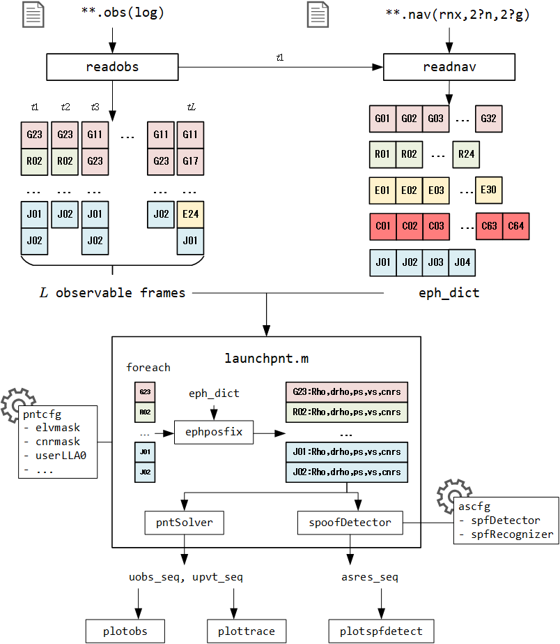
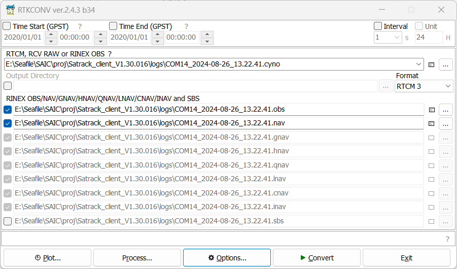
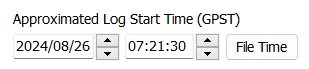
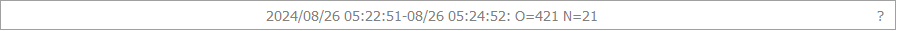
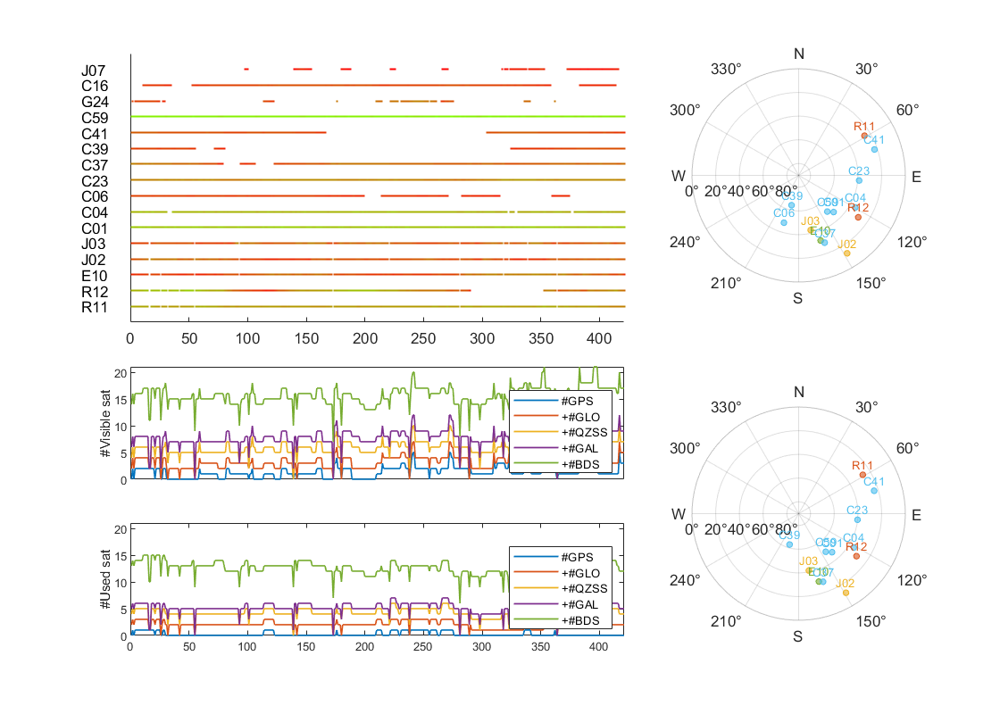
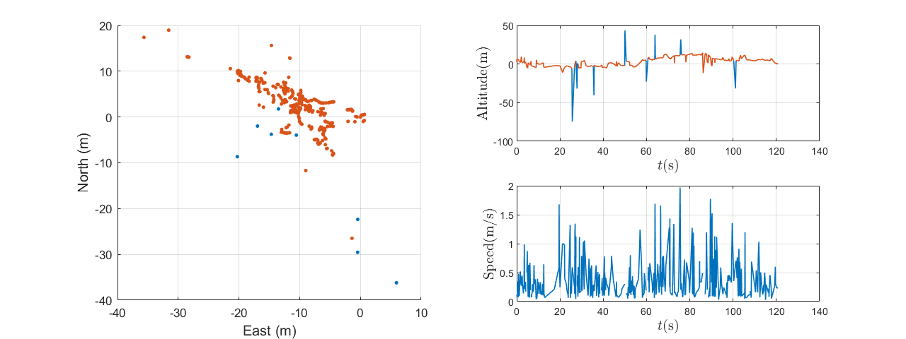
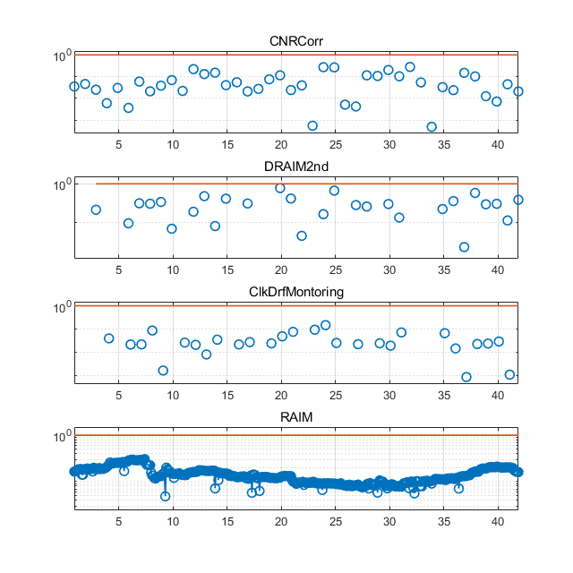

# antispooflib: open-source anti-spoofing library

[TOC]

## Major function

`antispooflib` is an observable-level GNSS anti-spoofing library, trying to facilitate development involving anti-spoofing techniques using observables as the input data. 

The input of `antispooflib` should include **observable** and **navigation data**, both in RINEX format. Those two files will be parsed first, and then used for foundamental PNT solution. During that process, the PNT results and the observables used are recorded. For each RINEX observable frame, a integrated GNSS spoofing detector (`sd`) is triggered, and the name of each specified spoofing detector involved in `sd` and its corresponding threshold, testing statistics and Boolean alarm are recorded.

The following figure shows the workflow of `antispooflib`：

- `readobs.m` is responsible for reading a `.obs` file, which should be a single or multiple constellation observable file.
  - Output: `obs_seq`, a sequence with `L` frames of observable
- `readnav.m` is responsible for reading a `.nav/.rnx/.2?g/.2?n`file, which should be a single or multiple constellation navigation data file
  - Output: `eph_dict`, a `dictionary` with keys formatted as `SNN`, such as `G01` for GPS SVN1.
  - Note: The navigation data time should be as close with that of the observable data as possible. Only the satellites in the `.obs` file with corresponding valid navigation data read by `readnav.m` are allowed to participate in PNT solution.

- `launchpnt.m` is responsible for PNT solution and spoofing detection using configurations `pntcfg`和 and `ascfg`
  - For each observable frame `obs` in `obs_seq`，look up `eph_dict` for the ephemeris involved.
  - Filter the observables according to `pntcfg`: elevation angle, signal strength, etc. The filtered observables, `uobs`, will be appended to `uobs_seq`, which means used observable sequence.
  - Use `pntcfg.pntSolver`, which should be a function handler, to execute PNT solution with `uobs`, and the results will be saved as an element in `upvt_seq` (user PVT sequence)。
  - If `ascfg.spfDetector` is not empty, all the spoofing detectors included in this function handler array will be called one after another. For each frame, an `sdres_t` array, whose size is depend on that of `ascfg.spfDetector`, is appended to `asres_seq`, including Boolean alarm, threshold and testing statistics。
- Finally, pass all the information outputted by `launchpnt.m` to corresponding visualization functions and plot figures.





## Principle of currently included anti-spoofing techniques

### Spoofing Detection

#### CNR Correlation

Reference:`antispoof/lib/cnrcorr.m`

Default detector calling format:

```matlab
@(rho,drho,ps,vs,cnrs,keys,cfg)cnrcorr(cnrs,keys,cfg)
```

Default parameter configuration:

```
'ObsRate'	,obs_rate  % observable-frame rate, [Hz]
'TAccum'	,3.0 % [sec], window length
'TStep'		,1.0 % [sec], window step
'Thresh'	,0.5 % thresh for the average correlation
'NumPoll'	,5	 % output filter window length
```

This method needs to track the CNR(carrier-to-noise ratio) of observed signals within a certain period of time. It is supposed that all the spoofing signals should be transmitted from the same antenna, while the authentic ones should come from different satellites from various degrees. Therefore, when the propagation path changes, the difference in CNR of authentic signals should be different, while the difference in CNR of spoofing signals tend to be the same.

So, this method requires frequency propagation path change between the transmitting spoofing antenna and the receiving antenna.

- Applicable for moving vehicles: Varying distance and shading environment
- Applicable for indoor places near a window: People passing may shade the spoofing signals transmitted indoor.

#### Doppler RAIM (DRAIM)

Reference: `antispoof/lib/draim2nd.m`

Default detector calling format

```matlab
@(rho,drho,ps,vs,cnrs,keys,cfg)draim2nd(drho,ps,vs,cfg)
```

Default parameter configuration

```
'ObsRate'	,obs_rate, % [observable-frame rate, Hz]
'TAccum'	,1.0, 	% [sec], window length
'NumPoll',	5,		% output filter window length
'Pfa',		1e-3 	% False-alarm rate
```

This method suppose that there should be relative motion between the receiving antenna and the spoofing transmitting antenna, and the spoofer can neither predict and compose the receiver's motion or take control of all PRN channels。

For details, please see *Doppler-Based RAIM for GNSS Spoofing Detection in Vehicular Applications*, Ziheng Zhou, Hong Li, etc, 2023.

#### Clock Drift Monitoring (CDM)

Reference: `antispoof/lib/cdm.m`

Default detector calling format

```matlab
@(rho,drho,ps,vs,cnrs,keys,cfg)cdm(drho,ps,vs,cfg)
```

Default parameter configuration

```
'ObsRate'	,obs_rate, % [observable-frame rate, Hz]
'TAccum'	,1.0, 	% [sec], window length
'NumPoll'	,5,		% output filter window length
'Af2Thresh'	,5e-8 	% clock-drift 1st component
```

This method utilizes the 1st order estimate of clock drift solved by direct Doppler solution(`lse7pnt`) within a certain period of time to detect spoofing attacks. Theoretically, clock drift estimates should be totally random in the absence of spoofing, and a linear mode in clock drift usually implies spoofing signals transmitted from a single antenna has taken control of all receiver channels, but they fail in composing the motion between receiver and spoofer.

This method can be viewed as a complementary method of Doppler RAIM.

#### Receiver Autonomous Integrity Monitoring (RAIM)

Reference: `antispoof/lib/cdm.m`

Default detector calling format

```matlab
@(rho,drho,ps,vs,cnrs,keys,cfg)raim(rho,ps,cfg)
```

Default parameter configuration

```
'ObsRate',obs_rate, 
'TAccum',0.1,	% accumulation time
'NumPoll',5, 	% output filter
'Pfa',1e-3, 	% False alarm rate
'Sigma2',300 	% [m^2], squared error of pseudo-range measurements
```

This method assume that the receiver outputs **both authentic and spoofing observables**. There must be inconsistency between that two groups of observables. As a result, the pseudo-range residuals obtained by subtracting the distance between the user's PNT solution and each satellite's position to the corresponding pseudo-range measurements would be significant.

- Inefficient for spoofing signals with precise pseudo-range alignment；
- Inefficient when the spoofer managed to conduct a *full-channel* spoofing.


## Step-by-step Usage

### Extract `.obs`  and `.nav` from`.ubx` or `.cyno`

Some GNSS modules can record raw observations in RTCM format, such as BGI which can output files in `.cyno ` format, and UBLOX which can output files in `.ubx ` format. By using `rtklib`, such files can be converted into the required `.obs` or `.nav` files for this application.

See: https://github.com/tomojitakasu/RTKLIB

Run `rtkconv.exe` in `bin`, select the `.cyno` or `.ubx` file. Then, configure `rtklib` as follows:

- Enable `GPS, GLO, GAL, QZS, BDS` in the `options` menu.
- Select the output format as `RTCM3`



Click `Convert`, input the approximate collecting time of the observables. Click `OK`.



Under normal circumstances, the number of successfully converted observation frames (O = *duration* multiplied by *observing rate*) and the number of ephemeris successfully received by the receiver will be printed as `N=...`. At this point, `.obs ` and `.nav ` files will appear in the output path.



### Configure `main.m`

`pntcfg` is configured as follows by default:

```matlab
pntcfg = struct( ... % PNT configurator
        'cnrMask', 20, 'elvMask', 10, ...
        'userLLA0', [30 120 0], ...
        'constellation', 'GRJEC', ...
        'pntSolver', @(rho, drho, ps, vs, cnrs)lse4pnt(rho, drho, ps, vs));
```

- cnrMask: Signal quality mask, unit dBHz, satellites below this value are ignored;

- elvMask: elevation mask, unit deg, satellites below this value are ignored;
- userLLA0: The initial latitude, longitude, and altitude position of the user, measured in [deg, deg, m], used for iteration and elevation calculation;
- constellation: A set of constellations used for positioning, G-R-J-E-C representing GPS, GLONASS, QZSS, Galileo, BDS. Not distinguishing order.
- pntSolver: PNT solver, handle input format requirement is ` @ (rho, drho, ps, vs, cnrs)`
  - Currently, only two types of solvers are supported: traditional LSE positioning+differential constant velocity, and direct Doppler LSE constant velocity positioning
  - `@(rho, drho, ps, vs, cnrs)lse4pnt(rho, drho, ps, vs))`
  - `@(rho, drho, ps, vs, cnrs)lse7pnt(drho, ps, vs))`

### Run `main.m`

Run `main.m` in MATLAB console.

1. Follow the GUI guidance and select the `.obs` file mentioned above

   - Console output example

     ```
     readobs: Loading from E:\Seafile\GNSS\gnss.workspace\antispooflib\data\COM14_2024-08-26_13.22.41.obs.
       421 data blocks detected.
       Progress: >>>>>>>>>>>>>>>   393/  421
       421 data blocks have been read successfully.
       Recorded from 2024-08-26 05:22:51 to 2024-08-26 05:24:51;
       Maximum/Minimum #obs =  34/  8;
     readobs: 421 observations loaded.
     ```

2. Follow the GUI guidance and select the `.nav` file mentioned above

   - It should contains the simultaneous ephemeris according to the `.obs` file。
   - Console output example

   ```
   readnav: Loading from E:\Seafile\GNSS\gnss.workspace\antispooflib\data\COM14_2024-08-26_13.22.41.nav.
     Number of valid emphemeris: 20.
     G: 2 ephemeris valid.
     C: 10 ephemeris valid.
     J: 3 ephemeris valid.
     E: 2 ephemeris valid.
     R: 3 ephemeris valid.
   readnav: 20 valid ephemeris loaded.
   ```

   - If there are not enough ephemeris in `.nav`, one may also download the broadcast ephemeris of that day from [CDDIS | | archive | gnss | data | daily | 2024 | (nasa.gov)](https://cddis.nasa.gov/archive/gnss/data/daily/2024/brdc/).

3. `launchpnt` will be launched automatically

   - Console output example

     ```
     launchpnt: launching PNT solution core, L=421
       pntcfg.constellation=GRJEC
       pntcfg.cnrMask=20.0[dBHz]
       pntcfg.elvMask=10.0[deg]
       pntcfg.userLLA0=[30.000000,120.000000,0.0]
       pntcfg.pntSolver=
         @(rho,drho,ps,vs,cnrs)lse4pnt(rho,drho,ps,vs)
       ascfg.spfDetector=(#4)array
         @(rho,drho,ps,vs,cnrs,keys,cfg)cnrcorr(cnrs,keys,cfg)
         @(rho,drho,ps,vs,cnrs,keys,cfg)draim2nd(drho,ps,vs,cfg)
         @(rho,drho,ps,vs,cnrs,keys,cfg)cdm(drho,ps,vs,cfg)
         @(rho,drho,ps,vs,cnrs,keys,cfg)raim(rho,ps,cfg)
       ascfg.spfRecognizer=[]
     
       pntSolver: User PNT calculator launched...
         Progress: >>>>>>>>>>>>>>>   393/  421
         User status obtained in ECEF coordinate.
         User status obtained in ENU coordinate.
       pntSolver: User PVT calculation finished.
     launchpnt: user PNT finished.
     ```

   - Possible warning: Insufficient number of positioning solution satellites, or insufficient number of satellites when deception detection algorithm calls positioning solution. For example, `lse4pnt` needs to solve the user's three-dimensional position and clock bias, requiring at least 4 satellites that meet the requirements of `pntcfg`, ` lse7pnt` needs to solve for the user's three-dimensional position, velocity, and clock drift, requiring at least 7 satellites that meet the requirements of pntcfg.

   - These warnings will result in PVT or deception detection results containing artificially added `NaN`

4. Finally, this application automatically draws result diagrams.

   - Channel information

     - The upper left subplot shows signal strength;
     - The lower left image shows the composition of observable(in `.obs`)/available (filtered by `pntcfg`) constellations for each observation frame. For example, the number of satellites with BDS width between the green and purple lines.
     - The two subplots on the right are skyplots of first and last moment.

     

   - Trajectory Overview, displaying the user's relative motion trajectory (left image), elevation (top right), and dashboard (bottom right)

     

     

   - The spoofing detection results show the deception detection results of all the deception detection methods declared in `ascfg.spfDetector` in this experiment. The blue dots represent the normalized detection statistics, while the orange red lines show the normalized detection threshold.

     - If an alarm occurs, it will be automatically highlighted with a red solid box. There is no alarm in the picture.
     - Sometimes there may be individual blue dots that exceed the orange red line but do not trigger an alarm, because the output filter set by the detector prevents individual spikes from triggering alarms to improve false alarm performance. To disable it, set the `NumPoll` to 0.

     

